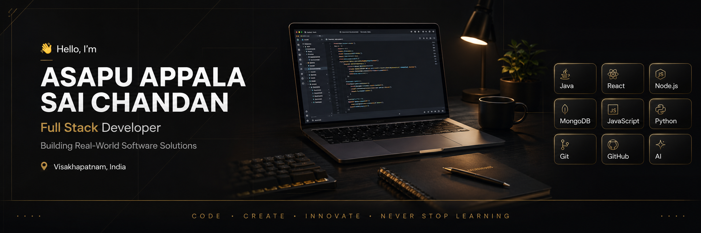

  

# 👋 Hi, I'm Asapu Appala Sai Chandan

🚀 Full Stack Developer | AI Enthusiast | Graphic Designer

I enjoy building fast, modern, and user-focused web applications using React, TypeScript, Node.js, and Java. I'm passionate about solving real-world problems through software and continuously improving my skills.

🌐 Portfolio: https://saichandan-portfolio.netlify.app

  

<h3 align="center">💻 Full Stack Developer • 🤖 AI Enthusiast • 🎨 Graphic Designer</h3>

---

# 🚀 About Me

- 🎓 B.Tech CSE Student (3rd Year) – Lendi Institute of Engineering and Technology
- 💻 Passionate about Full Stack Development
- 🤖 Exploring Artificial Intelligence & Machine Learning
- 🎨 Freelance Graphic Designer – Designs by Chandu
- 🌱 Learning Java, DSA, React, Node.js, MongoDB and TypeScript
- 🎯 Goal: Become a Software Engineer building impactful products.

---

# 🛠 Tech Stack

### Languages

### Frontend

### Backend

### Database

### Tools

---

# 🌟 Featured Projects

## 🏘️ Local Community Job Connect
A platform connecting local employers with job seekers using a modern full-stack architecture.

**Features**
- Authentication
- Job Listings
- Worker Profiles
- Responsive UI
- Secure Backend

---

## 🌾 AI Crop Recommendation System
Smart agriculture platform that recommends suitable crops based on soil and weather conditions.

**Future Scope**
- Disease Detection
- Yield Prediction
- AI Chat Assistant

---

## 🪖 Smart Army Canteen E-Commerce
Prototype CSD e-commerce system with secure authentication, product catalog, cart and order management.

---

## 🎨 Designs by Chandu
Portfolio showcasing branding, posters, social media creatives and freelance work.

---

## 🎒 Campus Lost & Found
A web application helping students report and recover lost items efficiently.

---

# 📚 Currently Learning

- Java
- Data Structures & Algorithms
- React.js
- Node.js
- MongoDB
- Artificial Intelligence
- TypeScript

---

# 🏆 Certifications

- 🏅 AWS Generative AI Virtual Internship
- 🏅 Introduction to NoSQL – Simplilearn
- 📖 Continuously learning React, TypeScript, Node.js, and DSA

---
# 🔥 Current Focus

- 🚀 Preparing for Software Engineering placements
- 💻 Building Full Stack Projects
- 📚 Practicing DSA in Java
- 🤝 Looking for Internship Opportunities

# 📊 GitHub Analytics

---

# 🤝 Open To

- 💼 Software Engineering Internships
- 🌍 Open Source Contributions
- 🤝 Collaboration on Full Stack Projects
- 🚀 Freelance Opportunities

---

# 📫 Connect

- 📧 asapusaichandan143@gmail.com
- 💼 LinkedIn: https://www.linkedin.com/in/asapuappalasaichandan9/
- 🐙 GitHub: https://github.com/aasaichandan9-cmd

---

> **"Code with purpose. Design with creativity. Build for impact..."**
## 🐍 Contribution Graph

  

## 🤝 Let's Connect

If you're interested in collaborating, discussing projects, or exploring opportunities, feel free to connect with me.

⭐ If you like my projects, consider giving them a star!
